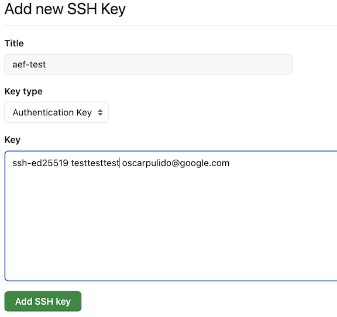
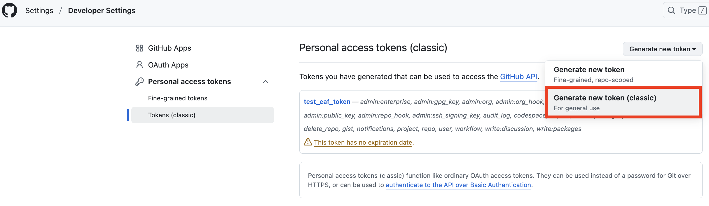
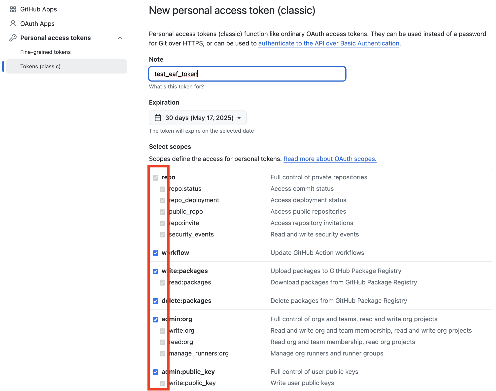

# Analytics Engineering Framework

[Analytics engineers](https://www.getdbt.com/what-is-analytics-engineering) lay the foundation for others to organize, transform, and document data using software engineering principles. Providing easy to use data platforms that empower data practitioners to independently build data pipelines in a standardized and scalable way, and answer their own data-driven questions.

The Analytics Engineering Framework comprised of:


1. [Orchestration Framework](https://github.com/googlecloudplatform/aef-orchestration-framework): Maintained by Analytics Engineers to provide seamless, extensible orchestration and execution infrastructure.
1. [Data Model](https://github.com/googlecloudplatform/aef-data-model): Directly used by end data practitioners to manage data models, schemas, and Dataplex metadata.
1. [Data Orchestration](https://github.com/googlecloudplatform/aef-data-orchestration): Directly used by end data practitioners to define and deploy data pipelines using levels, threads, and steps.
1. [Data Transformation](https://github.com/googlecloudplatform/aef-data-transformation): Directly used by end data practitioners to define, store, and deploy data transformations.

## Deploying the AEF, creating sample source data, and running a sample pipeline. 
***Note:*** Production deployments imply careful selection of projects where each component will be deployed. For production adhere to [best practices for establishing robust data foundations](https://github.com/GoogleCloudPlatform/cloud-foundation-fabric/tree/master/blueprints/data-solutions/data-platform-foundations) within these projects, and deploy each repository independently.

### Prerequisites:
- [gcloud cli](https://cloud.google.com/sdk/docs/install-sdk)
- [git](https://git-scm.com/book/en/v2/Getting-Started-Installing-Git) and [github](https://docs.github.com/en/get-started/getting-started-with-git/set-up-git)
- [python3](https://www.python.org/downloads/)
- [terraform](https://developer.hashicorp.com/terraform/install)
- A clean [GCP project](https://developers.google.com/workspace/guides/create-project) to deploy the AEF
- At least 5GB storage available. Please note that Cloudshell instances provide 5GB storage.

### Deployment:
Demo deployment takes up to 45 minutes, mostly due to Cloud SQL instance and Cloud Composer environment setup.
0. Manualy create a new project


1. Create a new ssh key to use with github (skip if already have a key).
   ```bash
   ssh-keygen -t ed25519 -C "your_email@example.com"
   eval "$(ssh-agent -s)"
   cat ~/.ssh/id_ed25519.pub
   ```
2. Add your recently created key (last output) to your github account (skip if your key is already configured in github).
   

3. Make sure you have a Classic personal github token available, if not create one like this: 
   
   

4. Login in gcloud
   ```bash
   gcloud auth login
   ```
   
5. Download `demo_deployment` folder containing demo deployment scripts:
   ```bash
   mkdir demo_deployment
   cd demo_deployment
   curl -L -H 'Cache-Control: no-cache' -H 'Pragma: no-cache' https://api.github.com/repos/googlecloudplatform/aef-orchestration-framework/contents/demo_deployment?ref=main |   grep -E '"download_url":' |   awk '{print $2}' |   sed 's/"//g;s/,//g' |   xargs -n 1 curl -L -O
   ```

6. Set variables :
    ```bash
   PROJECT_ID="your-gcp-project-id"
   DATAFORM_REPO_NAME="your-dataform-repo"
   LOCAL_WORKING_DIRECTORY="/home/admin_/aef-demo"
   GITHUB_USER_NAME="your-github-username"
   AEF_OPERATOR_EMAIL="[email address removed]"
   ```
7. Verify your pre-reqs are correctly installed:
   ```bash
   sh pre-reqs-install.sh
   ```
8. Enable required APIs:
    ```bash
    sh enable_aef_apis.sh "$PROJECT_ID"
    ```
9. If using a restrictive Organization set of policies (i.e. Argolis) follow instructions in the pre-requisites [here](https://github.com/anagha-google/spark-on-gcp-s8s/blob/main/01-foundational-setup.md#0-prerequisites) and run next script:
    ```bash
    sh relax_org_policies.sh "$PROJECT_ID"
    ```
10. Clone and deploy the AEF:
    ```bash 
    sh deploy_aef_repositories.sh "$DATAFORM_REPO_NAME" "$PROJECT_ID" "$LOCAL_WORKING_DIRECTORY" "$GITHUB_USER_NAME" "$AEF_OPERATOR_EMAIL"
    ```
11. Schedule your demo pipeline for execution:
    ```bash
    sh schedule_demo_pipeline.sh "$LOCAL_WORKING_DIRECTORY" "$PROJECT_ID"
    ```
   
### Cleanup:

```bash
./cleanup_demo_deployment.sh "$DATAFORM_REPO_NAME" "$PROJECT_ID" "$LOCAL_WORKING_DIRECTORY" "$GITHUB_USER_NAME" "$AEF_OPERATOR_EMAIL"
```
