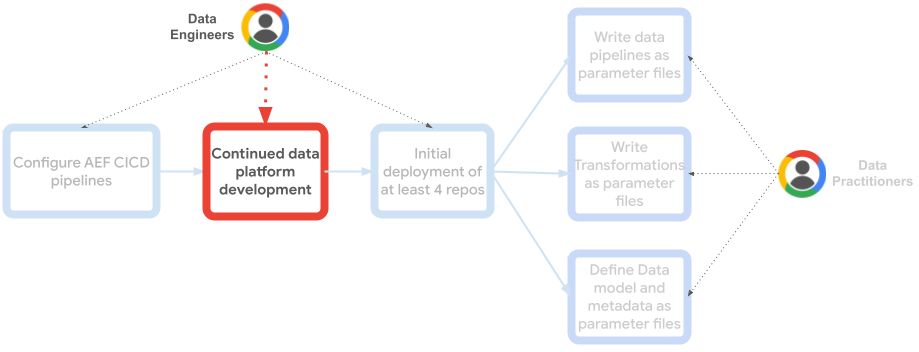
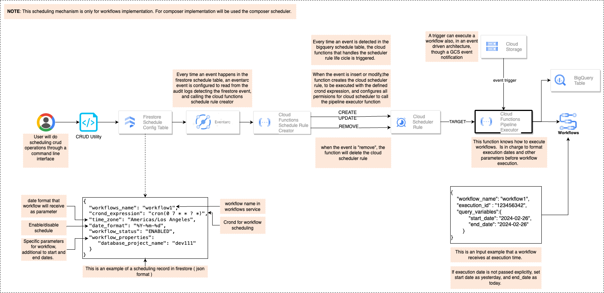

# Analytics Engineering Framework - Orchestration Framework

***Note:*** For a comprehensive installation guide of all the AEF repositories together, please look [here](https://github.com/googlecloudplatform/aef-orchestration-framework/blob/main/AEF_DEPLOYMENT.md).

[Analytics engineers](https://www.getdbt.com/what-is-analytics-engineering)  lay the foundation for others to organize, transform, and document data using software engineering principles. Providing easy to use data platforms that empower data practitioners to independently build data pipelines in a standardized and scalable way, and answer their own data-driven questions.

Data orchestration plays a vital role in enabling efficient data access and analysis, this repository deploys the core artifacts of a streamlined serverless data orchestration framework using generic executors as Google Cloud Functions. And deployed via Terraform.

This Orchestration Framework is the core integrator of the Analytics Engineering Framework comprised of:
1. **(This repository) Orchestration Framework**: Maintained by Analytics Engineers to provide seamless, extensible orchestration and execution infrastructure.
1. [Data Model](https://github.com/googlecloudplatform/aef-data-model): Directly used by end data practitioners to manage data models, schemas, and Dataplex metadata.
1. [Data Orchestration](https://github.com/googlecloudplatform/aef-data-orchestration): Directly used by end data practitioners to define and deploy data pipelines using levels, threads, and steps.
1. [Data Transformation](https://github.com/googlecloudplatform/aef-data-transformation): Directly used by end data practitioners to define, store, and deploy data transformations.



## Concepts
### Domain-Based vs. Central Orchestration

The [engine](https://github.com/oscarpulido55/aef-data-orchestration/blob/e7efd8ec7ad33a280290ba62573c7e7bf2734646/terraform/variables.tf#L17) variable currently supports `cloud_workflows` or `composer`. 

*   `cloud_workflows`:  Deploy Cloud Workflows in the project specified by the `project` variable. This allows for both **Domain-Based Orchestration** (deploying to a domain team's project) and **Central Orchestration** (deploying to a centralized project).

*   `composer`: Creates/uses a Composer environment in the data domain team's project, following a **Domain-Based Orchestration** approach. This addresses [Airflow scalability complexity](https://cloud.google.com/blog/products/data-analytics/scale-your-composer-environment-together-your-business?e=48754805) and aligns with [tenancy strategies for Cloud Composer](https://cloud.google.com/blog/products/data-analytics/a-cloud-composer-tenancy-case-study?e=48754805).

**Domain-Based Orchestration**: Isolates orchestration by domain, potentially simplifying IAM and networking but increasing operational overhead. Preferred for multi-domain environments with distinct data needs. This repository demonstrates this with one Composer environment per data domain team.

**Central Orchestration**: Consolidates orchestration, centralizing Data Ops and potentially reducing management complexity. Simpler for single-domain environments or those with shared networks. May require IAM adjustments. Easily achieved with Cloud Workflows due to its serverless nature.

The optimal approach depends on your organization's needs and constraints, including the number of domains, data access patterns, and networking configurations.

### Cloud Workflows Orchestration implementation:
When seeking a cost-effective and fully serverless orchestration solution for your Google Cloud Platform (GCP) data pipelines, Cloud Workflows emerges as a compelling alternative to Airflow/Composer.
- **Serverless Simplicity**: Eliminate the need to manage servers or GKE clusters at all, completely managed auto scalable serverless service.
- **No Software Tuning Required**: Avoid the complexities of configuring Airflow or Composer parameters for scaling (make composer scale to support more DAGs) or performance optimization (make Composer scale to support more concurrent tasks). No parameters to care about in Cloud Workflows, deploy and forget.
- **Zero Code**: Define your workflows using simple YAML files stored directly within Cloud Workflows.
- **Cost-Efficiency**: Take advantage of 5,000 free steps per month per project, often sufficient for most data platforms, especially with a decentralized approach. Additional steps are billed at a mere $0.01 USD per 1,000 steps. External API calls are priced separately (2,000 free/month, then $0.025 USD per 1,000).
- **Seamless GCP Integration**: Cloud Workflows seamlessly integrates with other GCP services, making it easy to incorporate tasks like BigQuery queries, Cloud Functions executions, and interactions with various Google Cloud APIs into your pipelines.
- **External API Connectivity**: Extend your workflow capabilities by effortlessly calling external APIs, enabling integration with third-party services and data sources.
 
After deploying data pipelines (levels, threads, and steps) as Cloud Workflows within a GCP project (typically using the data orchestration repository), each workflow step will reference a corresponding Cloud Function. These Cloud Functions must be able to interpret parameter files from the data transformation repository and execute tasks accordingly. The repository already contains execution examples like the Dataform tag executor, the Dataflow flex templates executor and the BigQuery saved Query executor, and you can define new, similar Cloud Functions for additional use cases. Ensure these functions are designed to be extensible and reusable across various jobs.

Furthermore, to facilitate operation and debugging, BigQuery tables storing orchestration metadata will be utilized. These tables will serve as a supplementary observability layer, providing insights beyond Cloud Logging and Cloud Monitoring.


### Scheduling and execution
To trigger Workflows, this streamlined execution approach leverages cron-based schedules defined as Cloud Scheduler rules. This allows for the storage and easy manipulation of scheduling definitions outside of the repository. You can change the frequency or execution time independently of the actual data pipeline definition, without requiring any repository commits or CI/CD processes. Simply insert or update a record in a Firestore configuration table. From there, an event-driven mechanism based on Eventarc and Cloud Functions will create or update the Cloud Scheduler accordingly.


### Repository
This repository defines and deploy the core components for data pipelines orchestration strategy leveraging Cloud Workflows for data pipeline definition and Cloud Functions for serverless execution.
```
├── functions
    ├── data-processing-engines
    │   ├── bq-saved-query-executor     
    │   ├── dataflow-flextemplate-job-executor
    │   ├── dataform-tag-executor
    │   ├── dataproc-serverless-executor
    │   └── ... 
    └── orchestration-helpers
        ├── intermediate
        ├── pipeline-executor
        ├── scheduling
        └── ...
```

## Usage
### Terraform
1. Define your terraform variables
<!-- BEGIN TFDTFOC -->
| name                                                          | description                                                                                                                                                                                                                 | type                                               | required | default                                 |
|---------------------------------------------------------------|------------------------------------------------------------------------------------------------------------------------------------------------------------------------------------------------------------------------------|----------------------------------------------------|----------|-------------------------------------------|
| [project](terraform/variables.tf#L17)                         | Project ID where the AEF Orchestration Framework will be deployed.                                                                                                                                                            | string                                                 | true     | -                                        |
| [region](terraform/variables.tf#L23)                          | Name of the region for the components to be deployed                                                                                                                                                                       | string                                                 | true     | -                                        |
| [operator_email](terraform/variables.tf#L29)                  | email of the data platform operator for error notifications                                                                                                                                                                     | string                                                 | true     | -                                        |
| [workflows_scheduling_table_name](terraform/variables.tf#L35) | workflows scheduling table name                                                                                                                                                                                                     | string                                                 | true     | workflows_scheduling                      |
<!-- END TFDOC -->

2. Run the Terraform Plan / Apply using the variables you defined.
```bash
terraform plan -var 'project=<PROJECT>' -var 'region=<REGION>' -var 'operator_email=<EMAIL>'
```